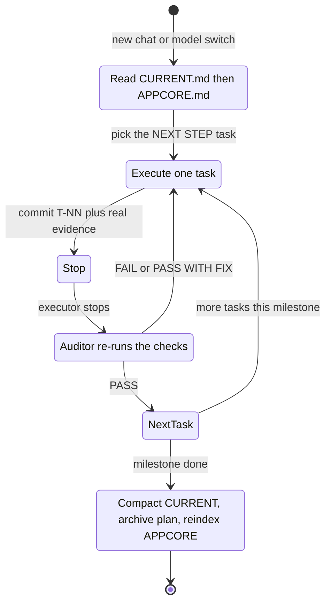

# agents-workflow

**Durable project memory for AI coding agents.** A workflow where your project's
state lives in a handful of versioned Markdown files — not in the chat window — so any
agent (Claude Code, Cursor, OpenCode, …) can pick up exactly where the last session,
model, or tool left off.

Portable, tool-agnostic, and battle-tested on a real product taken from v1.0 to v1.7.7
(30+ audited tasks, multiple releases, three systemic bugs found and killed) where the
chat kept ballooning and getting summarized away. The fix was simple: **files are
memory.**

---

## The problem it solves

- Chat context grows, gets truncated/summarized, and you lose the thread.
- Switching model or tool means starting cold.
- "I already told you that" — but the agent doesn't remember, because memory lived in
  the conversation.

## The idea in one line

Keep project state in `.agents/*.md` files that travel with the repo, get read at the
start of every session, and are **compacted, not appended forever** (git holds the
history). Add an **executor / auditor** split so quality doesn't depend on trust.

```
.agents/
├── AGENTS.md    # doctrine: roles + the hard rules
├── CURRENT.md   # live state: what happened, audits, NEXT STEP
├── PLAN.md      # roadmap by phases
├── APPCORE.md   # code map: what lives where
├── CONTEXT.md   # append-only session log
├── TESTING.md   # test matrix with results
└── archive/     # closed milestone plans
```

A fresh chat catches up by reading two files: `CURRENT.md` → `APPCORE.md`.

---

## The executor + auditor duo (the heart of it)

The method is built around **two roles**, and the whole thing works *because* they are
separated:

- **Executor** — writes the code. Takes **one** task, records **real evidence** (pasted
  command output), and STOPs.
- **Auditor** — plans the work, writes task specs with **acceptance criteria**, and
  **re-verifies every delivery itself** — re-running the greps / compiles / tests,
  auditing the **commit** (not the half-edited working tree) — before giving a verdict:
  `PASS` / `PASS WITH FIX` / `FAIL`. **It never trusts the executor's report.**

In the origin project this split caught a report that claimed *"verified"* on a check
that was actually **failing** — because the auditor re-ran it instead of believing it.
That single discipline is most of the value.

### You choose the orchestration (per project)

The roles are a *contract*, not a fixed setup. Run them whichever way fits the project —
the files and rules stay identical:

| Mode | How it runs | Best when |
|---|---|---|
| **Executor → Auditor** (two agents) | A fast/cheap model executes; a stronger model audits in a **separate** chat that only sees the output, not the executor's reasoning | High-stakes code; you want a genuinely independent second pair of eyes; long projects |
| **Auditor / Executor** (one agent, two hats) | The **same** agent plans, executes, then audits its own commit against the criteria | Small or fast-moving projects; when one strong model is enough; solo prototyping |
| **Human auditor** | An agent executes; **you** audit and give the GO | Sensitive code, or you want final control over every merge |

Pick based on the project's risk and your budget. You can even switch mid-project
(start solo with *Auditor/Executor*, promote to *Executor → Auditor* once it's
load-bearing). `AGENTS.md` records which mode is active so a fresh session knows.

### The loop, as a state machine

Every session — new chat or a different model — re-enters the same cycle. Nothing
depends on remembering the last conversation; the files carry it.



---

## When to use it (and when it's overkill)

Use it when the project is **multi-session, multi-file, or hand-crossed between agents
or models** — anything you'll return to and can't hold in one context window. That's
exactly where projects silently break: the new session doesn't know the rules,
re-derives the architecture, and reintroduces a bug you already fixed.

Skip it — or use a stripped two-file version (`CURRENT.md` + `AGENTS.md`) — for
throwaway prototypes, a single-file script, or a one-sitting task. The ceremony only
pays off across sessions. **Start light; add files as the project earns them.**

---

## Install

### Any agent — generic copy/paste (works everywhere)

The most portable install: drop the workflow into a root `AGENTS.md` — the
[agents.md](https://agents.md) standard, read by Claude Code, Cursor, OpenCode, Zed,
Aider and more. No clone, no tooling.

```bash
# Linux / macOS — add the workflow to your project's AGENTS.md
curl -fsSL https://raw.githubusercontent.com/Gusitir/markdown-project-structure/main/skill/agents-workflow.md >> AGENTS.md
```
```powershell
# Windows PowerShell
(Invoke-WebRequest -UseBasicParsing https://raw.githubusercontent.com/Gusitir/markdown-project-structure/main/skill/agents-workflow.md).Content | Add-Content AGENTS.md
```

**No shell at all?** Open [`skill/agents-workflow.md`](skill/agents-workflow.md), copy
the whole file, and paste it into your project's `AGENTS.md` — or straight into your
agent's chat. That's the entire skill.

> The one-liner appends, so re-running it duplicates the block. For clean *updates* use
> the native installer below (it replaces in place between markers).

### Native per-agent (script)

Gives each agent its idiomatic home (Claude skill, Cursor rule, …):

```bash
# from a clone of this repo
./install.sh --agent claude --global        # Linux/macOS
```
```powershell
.\install.ps1 -Agent claude -Global         # Windows
```

`--agent` (`-Agent`) is one of `claude` · `cursor` · `opencode` · `generic`.
Use `--global` for a home-level install (available in every project) or
`--project DIR` (default `.`) for a single project.

### Manual (copy the file yourself)

The skill body is [`skill/agents-workflow.md`](skill/agents-workflow.md). Place it where
your agent looks, with the frontmatter shown:

| Agent | Location | Frontmatter to prepend |
|---|---|---|
| **Claude Code** | `~/.claude/skills/agents-workflow/SKILL.md` (global) or `<proj>/.claude/skills/…` | `---`<br>`name: agents-workflow`<br>`description: <see below>`<br>`---` |
| **Cursor** | `<proj>/.cursor/rules/agents-workflow.mdc` | `---`<br>`description: <see below>`<br>`globs:`<br>`alwaysApply: false`<br>`---` |
| **OpenCode** | `<proj>/AGENTS.md` or `~/.config/opencode/AGENTS.md` | none (plain section) |
| **Generic** ([AGENTS.md](https://agents.md) standard) | `<proj>/AGENTS.md` | none (plain section) |

Description string for the frontmatter:

> Bootstrap and maintain the .agents/ Markdown project-memory workflow (executor/auditor
> roles, files as durable state). Use when starting a new project with this system, when
> asked to set up .agents/, or to plan / audit / compact project state.

For OpenCode / generic AGENTS.md, the installer wraps the content in
`<!-- BEGIN agents-workflow -->` … `<!-- END agents-workflow -->` markers so re-running
it updates in place instead of duplicating.

---

## Use it

Once installed, tell your agent:

> "Set up the `.agents/` structure for this project — here's the plan: …"

It will create the folder from the [templates](templates/.agents), personalized to your
project, and from then on maintain state there. Bootstrap templates you can also copy by
hand live in [`templates/.agents/`](templates/.agents).

**See it in action:** [`examples/todo-api/.agents/`](examples/todo-api/.agents) is a real
`.agents/` folder caught mid-project — a bug flows from a test failure, through triage,
to a root-cause fix, to a one-line rule. Point any agent at it and ask *"what's the exact
next step and why?"* — it'll answer correctly without you explaining a thing. That's a
project resuming itself. ([walkthrough](examples/README.md))

**Optional enforcement:** [`hooks/pre-commit`](hooks/pre-commit) blocks committed secrets
and warns when `CURRENT.md` bloats past the compaction threshold — so the rules hold even
when nobody's watching. ([install](hooks/README.md))

**Plays well with native memory:** this complements your tool's own memory (`CLAUDE.md`,
Cursor rules, …) — those hold *your* preferences; `.agents/` holds the *project's* state
and travels with the repo. If your tool auto-loads a root instructions file, add one
line: *"At session start, read `.agents/CURRENT.md` then `.agents/APPCORE.md`."*

---

## What makes it work (the non-obvious parts)

- **The auditor never trusts the report.** Every acceptance criterion is proven with
  real command output; the auditor re-runs the checks itself and audits *commits*, not
  the working tree.
- **Compaction over accumulation.** `CURRENT.md` is trimmed on every milestone close —
  the history is already in git. A file that grows forever stops being read.
- **`APPCORE.md` is a verified map**, not documentation. Kept honest by a `reindex`
  pass that greps the real repo. An index that lies is worse than none.
- **War stories become rules.** Every incident → confirmed root cause → a one-line rule
  in `AGENTS.md`. Over time this becomes the most valuable file in the repo.

Full methodology, the file contract (who writes what, when, and what must *not* go in
each file), and the hard rules: [`skill/agents-workflow.md`](skill/agents-workflow.md).

---

## Repo layout

```
skill/agents-workflow.md   # the canonical skill (single source of truth)
templates/.agents/         # starter files the workflow creates
examples/todo-api/.agents/ # a real, filled-in .agents/ caught mid-project
hooks/pre-commit           # optional: block secrets, warn on CURRENT.md bloat
install.sh · install.ps1   # per-agent installers
```

## License

MIT — see [LICENSE](LICENSE). Use it, fork it, adapt the rules to your own scars.
